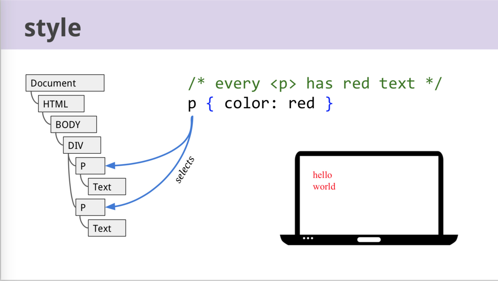
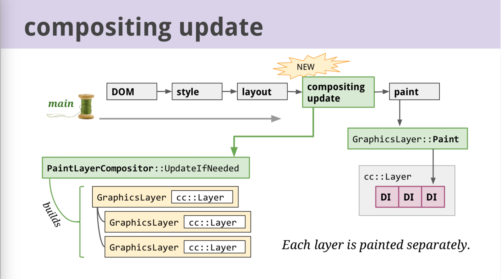
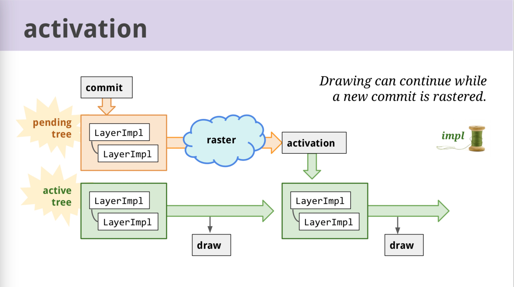
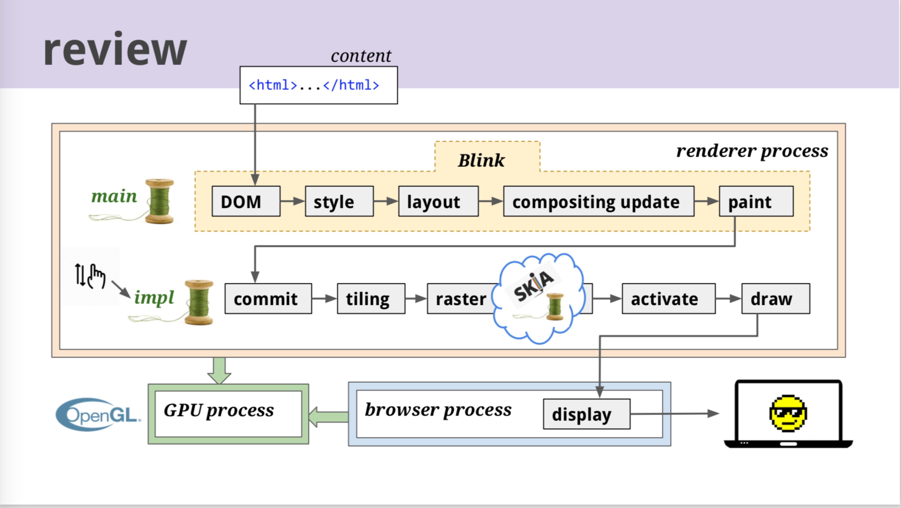

# Life of a Pixel

> Life of a Pixel 本来是 Chromium 团队在入职培训时的培训资料，其目的是为了让新入职的同事能够从大体上快速的了解 Chromium 的架构，而不是纠结于代码逻辑。现在该团队正式将其发布，也是为了对于此感兴趣的工程师能够快速的了解项目，参与项目的开发协作。本视频的内容，从宏观上来说，就是本演讲的题目 Life of a Pixel，直译就是一个像素点的一生，表示该演讲作者希望观众能够在视频结束后了解，前端的工程师所完成的代码，是如何通过浏览器，变为一个又一个的像素点，以及像素点是如何更新和毁灭的。

## 大体流程

1. web content （代码）
2. magic (渲染)
3. pixels (像素)

- HTML(Hyper-Text Markup Language, 页面结构与内容)
- CSS(Cascading Style Sheets， 页面样式)
- JS(JavaScript， 负责页面结构与内容和页面样式的更新)

浏览器真正渲染的内容在红框内，之外的都是非渲染的部分。渲染的引擎可以看做是一个黑箱，在 Chromium 中，我们把它称为 Blink。

同时，在渲染时，我们需要调用图像处理的底层 API 去进行渲染，对于此，有官方的统一标准就是 openGL，但是，对于 Windows，可能还需要转化为 DirectX。对于此，团队正在开发一个新项目名为 Vulkan，为了进行统一化。当然，这种底层的 API 并不能读懂我们的 HTML 和 CSS，它们只能做一些简单得图像绘制，诸如画一些多边形这种操作。

所以，我们再梳理一遍流程。总的来说就是我们要将 web content 转化为对于的图像处理的 API，在电脑屏幕上进行绘制。在这个过程中，为了更好地将已经渲染的图像更新，我们要设计一种数据结构，能够帮助我们更新这个页面的结构与内容和页面样式。这些更新就包括我们熟知的 JavaScript API，用户在输入框输入，异步加载，动画，卷轴移动，页面缩放。

## 初始渲染

### parse(解析)

### DOM

HTML 的结构，是一种天然的语义化的继承式的结构。语义化是标签所带来的，集成式是树状结构所带来的。我们可以将 HTML 看做输入进行解析，成为一颗我们熟知的 DOM 树。很好的诠释了父子间，兄弟间的关系。我们也可以很直观的从 JavaScript 所暴露出的 DOM API 中发现。

### Style

CSS 因为是 HTML 的装饰，所以自然而然的也是要依附到 DOM 对象上。依附的过程，也就是 CSS 选择的过程。但是由于 HTML 的树状结构，CSS 有时需要写的十分复杂以去高效的匹配到相对应的 DOM 元素。

在 CSS 解析时，解析器会将每一个选择器所选择的 CSS 属性名和属性值保存，作为 map，同时视频中提及，CSS 属性名是由 C++ 进行生成的，该 C++ 文件在构建时由 python 脚本自动生成。下一步，称为重计算（recalc），对于所有产生的属性，我们会计算它们的叠加和，作为每一个 DOM 元素的每一个属性的值，这个值我们也称为计算值。也就是最终渲染的结构。这个属性值我们可以使用 Chrome 的 API 或者是 JavaScript DOM API 均可以得到。

### Layout

通过上面获得的计算属性，我们就可以确定每一个元素在视图上占据的确定位置。这里举一个简单的例子。就是每一个元素是由上向下依次排列的，每一个元素的高度由字体的大小和间距所决定。但是，实际情况往往可能比较复杂。

比如一个元素的内容超出了边界。那么该元素会呈现可滚动的特性，这时页面需要实时计算显示的区域。再比如表格布局，浮动，文本分列，flex 布局，writing-mode等属性，都会带来布局的复杂程度。所以，我们需要一个更加完善的数据结构去存储这样一些状态，使得每一次迭代都能够变得高效和纯粹。

这里引入了新的数据结构，也是对于之前重计算所得到的 Render Tree 的进一步封装，将之前的复杂情况进一步考虑，得到最终每一个元素在视图上的最终位置，即 Layout Tree。需要注意的是，不是每一个 DOM 元素都对应有一个 Layout Object，比如对于一个 display 属性设置为 none 的元素。同时，也不是每一个 Layout Object 都对应于一个 DOM 元素，比如伪元素。

基于 Layout Tree，我们就可以处理 overflow 等一系列复杂情况。但还有一个个问题是，这种数据结构没有将输入的计算属性和输出的视图位置分离开，所以这里提及了一个正在开发的新项目名为 LayoutNG 就是为了解决这个问题。

### Paint

得到了上个步骤的 Layout 对象也就意味着我们可以真正的绘制像素了。但注意，这里的绘制也仅仅是语义上的，并没有落实到屏幕上。我们会再一次将 Layout 对象转化为一个一个矩形和其对于的颜色，并且将其按堆栈的形式显示，并非是 DOM 的出现顺序。并且每一次渲染都是根据某一种属性，比如 PPT 中简化的几种，背景，浮动，前景，轮廓。在示例中虽然带有 blue class 的元素在 green class 之后，可是 green class 中的文字却显示在最前，原因也就是 foreground 属性在视图的位置上，要先显示。

### Raster

这里我们得到了元素最终在视图的显示信息，我们就需要真正的进行预渲染。在这一步，我们会将屏幕上每一个像素点的颜色生成为一个 32 位的二进制码，分别表示 4 中颜色，同时我们可以利用 GPU 进行渲染加速，这里还要提及的是使用 Google 自主开发的 skia 项目进行图像处理渲染，通过最底层的 OpenGL。同时 skia 作为一个单独的项目，也支持了其他的大型项目，比如安卓系统。

### gpu

最后需要注意的是真正再通过 skia 调用的 openGL API 会通过 CommandBuffer 调用 GPU 进程，进行真实的渲染。也就是说，真实的渲染是独立出去的，当这一部分进程宕机时我们可以快速的重启。同时之前也提到过，这里我们会将 openGL 转化为 DirectX 在 Windows 平台上，通过 Angle 这个库。当然，Vulkan 的开发就是为了统一，同时，开发者也在尝试着将 skia 调用这个模块也放入 GPU 的进程。

### 总结

我们假设初次渲染已经完成，但是，对于前端的快速发展，大量的逻辑已经由后端转往前端实现，DOM 的更新变得异常频繁。简单地说，我们需要在原有 DOM 上做适量的改动重新渲染。为了不重新将上图的整个流程全部再次进行，这里我们就需要将其中的某些状态保留，提高更新效率。

## 更新渲染

### 引入

在更新渲染时，有时我们会缩放页面，区域滚动，或者是有动画。在这类型的情况下，如果渲染速率低于60帧，那么人眼看到会变得有些卡顿。

所以我们要尽可能判断出在上节提到的每一个步骤中，有哪些元素是需要改变的，哪些不需要是可以重新利用的，做到效率的优化。这也是在技术实现中也被考虑到的地方。

但是，实际情况是，有时一个大的区域全部改变，那么我们不得不对这个大的区域进行全部重新渲染，比如区域滚动。

还要注意的是 JavaScript 的设计是单线程的，也就意味着在渲染时，加入有 JS 脚本的执行，就会阻塞当前的渲染。

### 解决方案 compositing

基于之前提到的种种问题，Chromium 团队提出了 compositing 这种解决方案。目的就是优化性能。有点类似于 Photoshop，简单得说，有两点：

1. 页面分成独立的层，每一层之间的渲染是独立的
2. 单独使用一个线程（impl）去渲染层

在我们进行动画，滚动，缩放等操作时，浏览器会监听用户的输入行为，在 impl 线程上进行工作，使得主线程执行 JavaScript，互不干扰，但是假如 impl 线程发现这个事件无法处理，则还是会交还给主线程。

在实现层这个概念时还是会借鉴初次渲染的数据结构，也就是树，称为 Layer Tree。它是命名在 cc(Chromium compositor)下，主要数据信息由之前的 Layout Tree 继承而来。注意，这里还有一个 PaintLayer Tree, 类似于一个中间状态，将一个 Layout Object 进行分层，并且赋予其功能，例如对子元素进行裁切或者是施加别的效果。

自然而然，我们将会在 layout 和 paint 这两个阶段中加入 compositing update 去加快大区域重新渲染，获得 layer tree。需要注意的是，现在团队中正在进行一个工程，称为 slimming paint，将 layer tree 的建立放在 paint 阶段后，目的是为了将每一层 layer 的建立变得更加独立，并且建立属性树，提取出独立或者公共的属性，尽可能地将其放到真正像素级渲染之前。当 impl 线程的 paint 阶段结束后，就可以通知主线程进行同步，有点类似于使用 git 在不同分支上合并代码。

在 raster 之前还有一步优化，对于大面积滚动视图，没有必要一开始将所有的内容全部变换成 bitmaps，我们只需要将视窗中的先进行转化，在这里有一个 tiling manager，它负责将区域分块，就像地板上的瓦块一样，随着滚动区域的变化，将相邻区域的瓦块优先渲染。

所有主要的阶段已经大体介绍完毕。欢迎补充和加深！
